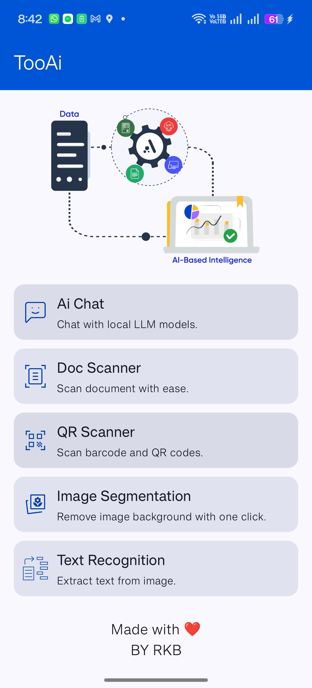
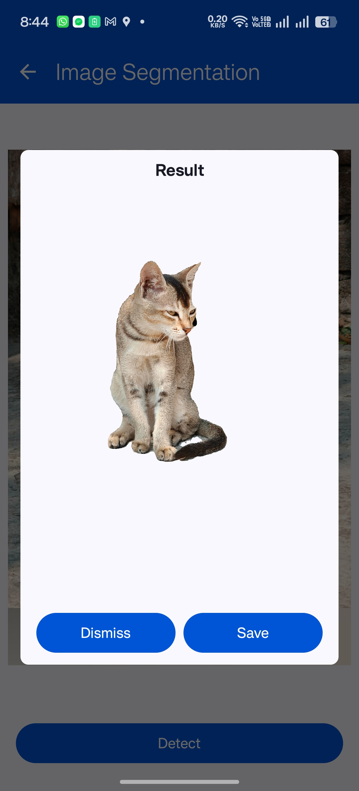
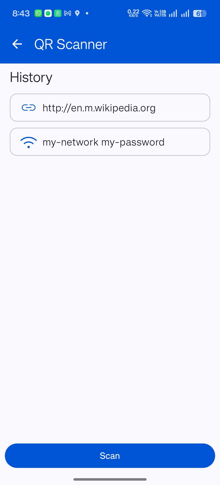
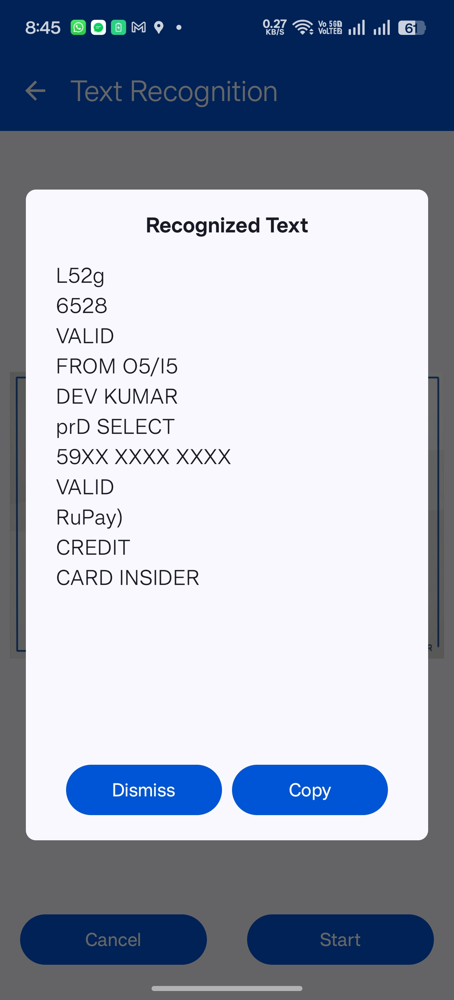
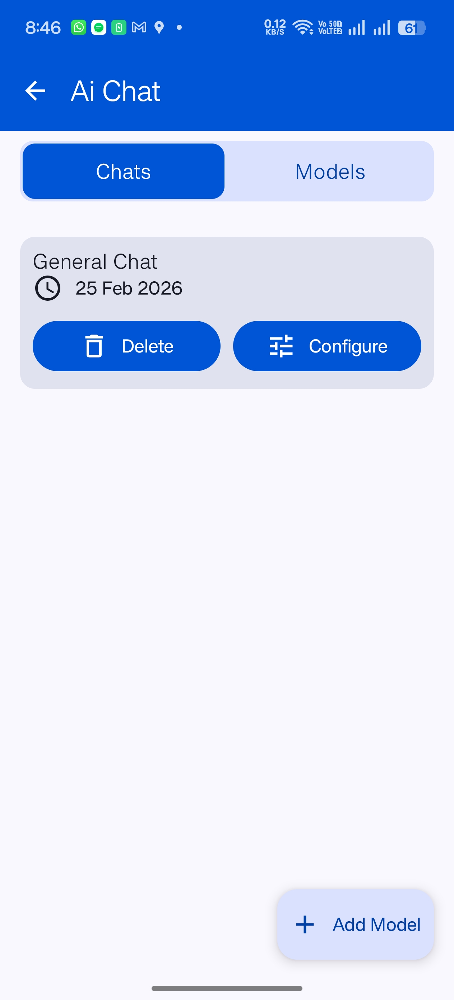
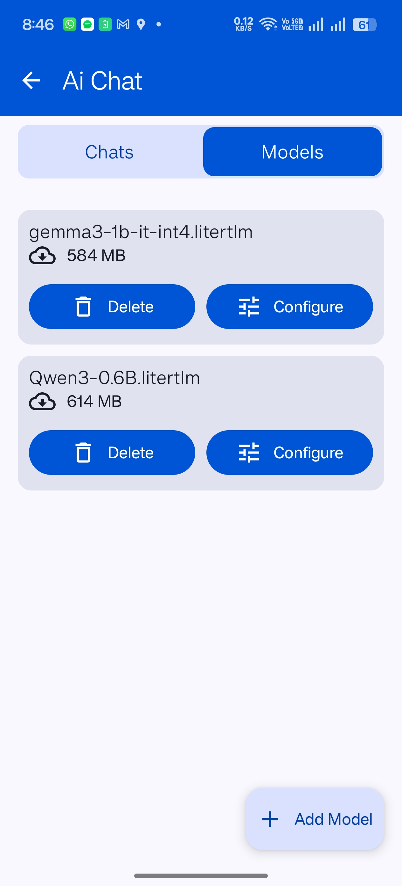
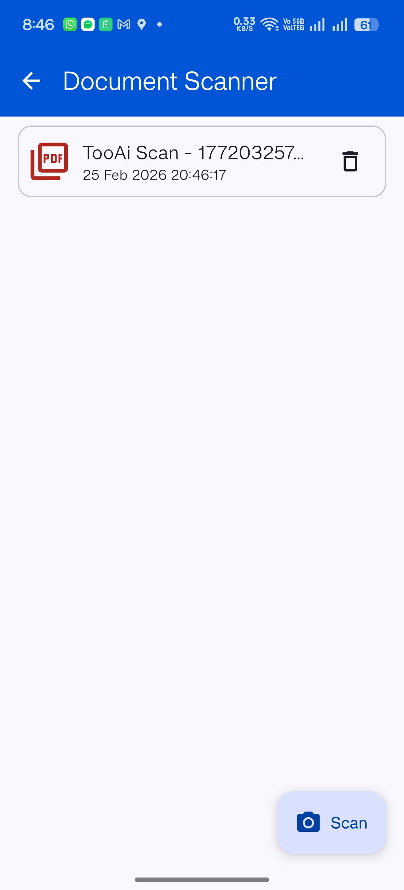

# TooAi

A powerful, offline-first Android application built with Jetpack Compose, utilizing Google ML Kit and the Google AI Edge SDK to bring advanced machine learning features directly to your device.

# Features

- **Run LLM models on device**: Chat offline with large language models (Requires Android 12+).
- **Document Scan**: Scan physical documents using the camera.
- **Text Recognition**: Extract text from images.
- **Barcode/QR Code Scan**: Scan and decode barcodes and QR codes.
- **Image Segmentation**: Remove background from any image.

*Note: All features work offline on the device.*

# Tech Stack and Libraries

- [Kotlin](https://kotlinlang.org/) : First class and official programming language for Android
  development.
- [Coroutines](https://kotlinlang.org/docs/reference/coroutines-overview.html) : For managing
  background threads with simplified code and reducing needs for callbacks.
- [Flow](https://kotlinlang.org/docs/reference/coroutines/flow.html) : A cold asynchronous data
  stream that sequentially emits values and completes normally or with an exception.
- [Jetpack]
    - [Compose](https://developer.android.com/jetpack/compose) : Modern toolkit for building native
      UI.
    - [ViewModel](https://developer.android.com/topic/libraries/architecture/viewmodel) : Stores
      UI-related data that isn't destroyed on UI changes.
    - [Room](https://developer.android.com/topic/libraries/architecture/room) : SQLite object
      mapping library.
- [Hilt](https://developer.android.com/training/dependency-injection/hilt-android) : Dependency
  injection library for Android that reduces the boilerplate of doing manual dependency injection in
  your project.
- [ML Kit](https://developers.google.com/ml-kit) : A mobile SDK that brings Google's machine
  learning expertise to Android and iOS apps in a powerful yet easy-to-use package.
- [Google AI Edge SDK](https://ai.google.dev/edge) : Tools to build and deploy on-device machine learning.
- [LiteRT-LM](https://ai.google.dev/edge/litert) : Runtime for running Large Language Models on-device.

# Architecture

- MVVM Architecture (View - DataBinding - ViewModel - Model)
- Repository pattern

# Screenshots

|                           Home                           |                           Image Segmentation                           |                           QR code Scanner                           |
|:--------------------------------------------------------:|:----------------------------------------------------------------------:|:-------------------------------------------------------------------:|
|  |  |  |

|                            Text Recognition                            |                           AI Chat                           |                           AI Models                           |
|:----------------------------------------------------------------------:|:-----------------------------------------------------------:|:-------------------------------------------------------------:|
|  |  |  |

|                           Document Scan                           |
|:-----------------------------------------------------------------:|
|  |


#License

```
MIT License
