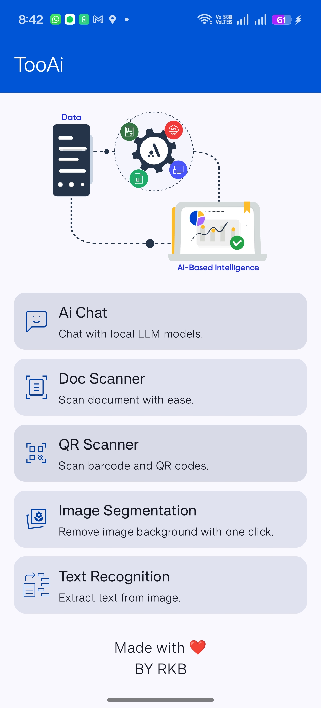
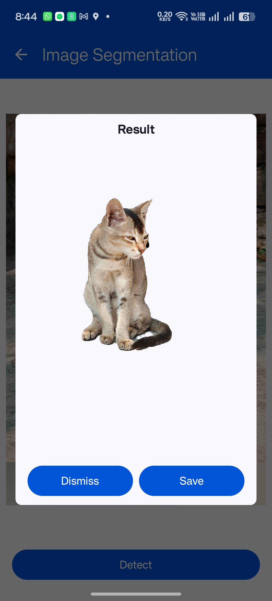
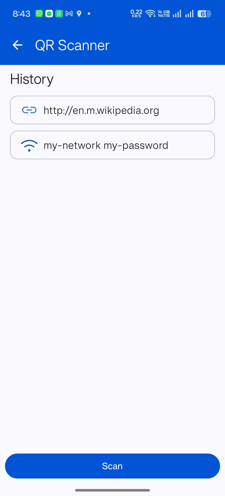
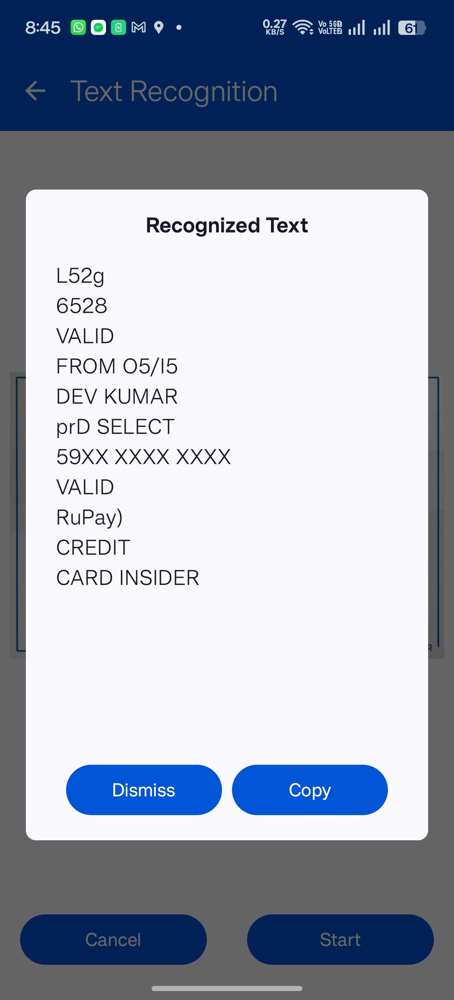
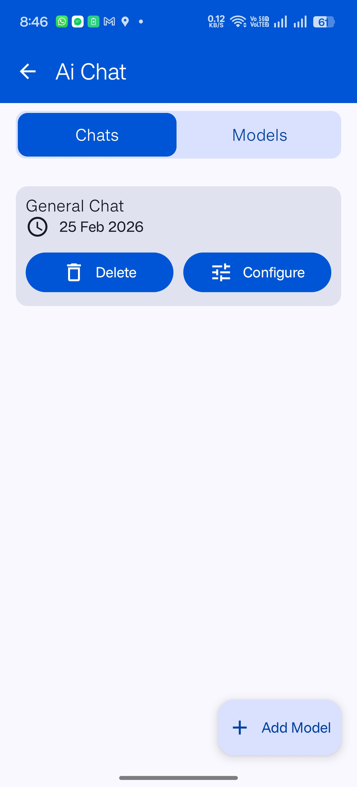
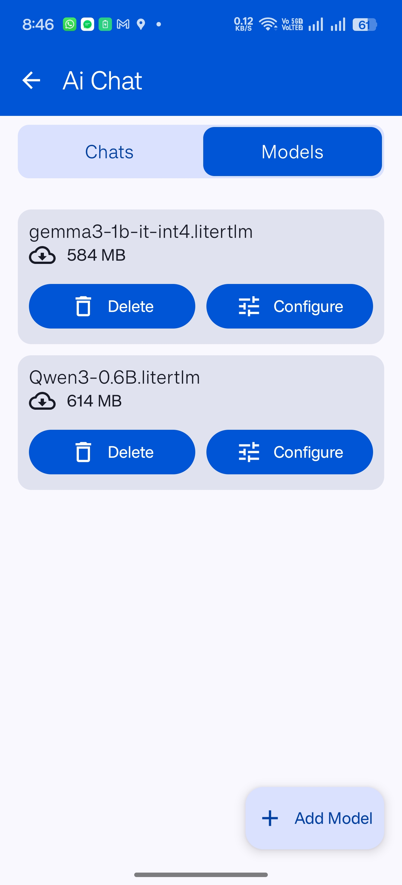
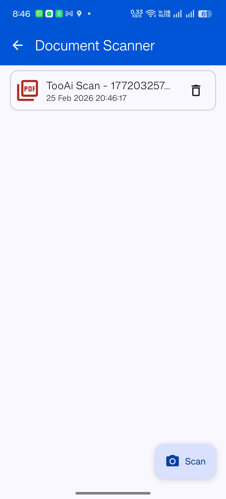
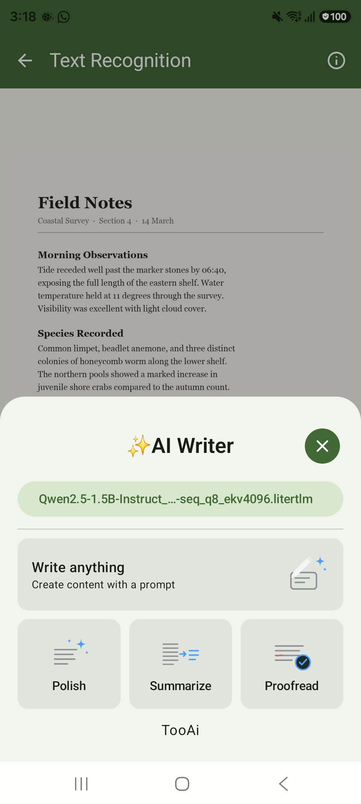
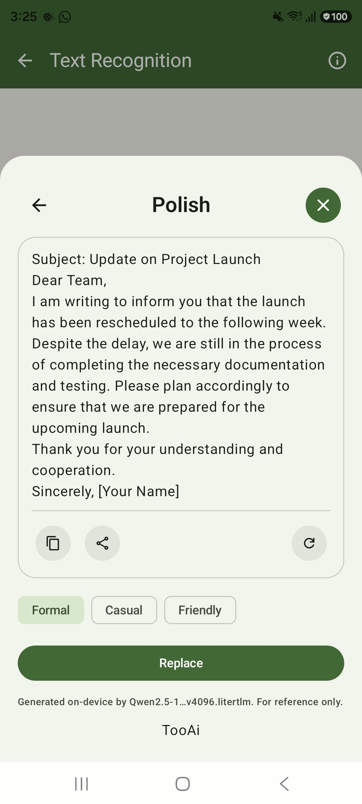

# TooAi

A powerful, offline-first Android application built with Jetpack Compose, using Google ML Kit and
LiteRT-LM to bring advanced machine learning features directly to your device.

Everything runs locally — there is no account, no ads, no analytics, and nothing you type or scan is
uploaded to a server.

# Features

- **Run LLM models on device**: Chat offline with large language models you import yourself
  (requires Android 12+).
- **AI Writer**: Rewrite, summarize or proofread selected text in *any* app, from the text-selection
  menu.
- **Document Scan**: Scan physical documents with the camera and save them as shareable PDFs.
- **Text Recognition**: Extract text from images, including Devanagari script.
- **Barcode/QR Code Scan**: Scan and decode barcodes and QR codes, with a searchable local history.
- **Image Segmentation**: Remove the background from any image and save the cutout.

*Note: all inference happens on the device. Language models are supplied by you and never leave the
phone. The scanner, barcode and segmentation features use Google Play Services on-device ML modules,
which are fetched once and then run offline.*

# AI Writer

`AiWriterActivity` registers for `ACTION_PROCESS_TEXT`, so TooAi appears in the text-selection
toolbar of every app on the device. Select text anywhere, tap **TooAi**, and pick an action:

| Page      | Options                                     |
|-----------|---------------------------------------------|
| Polish    | Formal · Casual · Friendly                  |
| Summarize | Bullet points · Short paragraph · Concise   |
| Proofread | Grammar · Clarity · Concise                 |
| Prompt    | Free-form instruction, selection as context |

When the host app allows editing, **Replace** writes the result straight back into the field.
`ACTION_SEND` is registered as a share-sheet fallback for read-only cases.

The writer keeps its own repository and never touches the chat database, so rewriting text from
another app cannot create chat sessions.

> On Samsung One UI the text-selection entry is gated behind an opt-in list in
> **Settings → General management → TooAi**. On stock Android it appears automatically, once the app
> has been launched at least once after install.

# Requirements

- Android 8.0 (API 26) or newer for the scanning, OCR and segmentation tools
- Android 12 (API 31) or newer for on-device LLM chat and the AI Writer
- A `.task` or `.litertlm` model file, imported from **Models → Import Model**

Models are not bundled with the app. Larger models need more RAM; 1B–2B parameter models are a good
fit for most phones.

# Getting Started

```sh
./gradlew :app:assembleDebug
adb install -r app/build/outputs/apk/debug/app-debug.apk
```

Run the unit tests with:

```sh
./gradlew testDebugUnitTest
```

To exercise the AI Writer without a host app, send it a `PROCESS_TEXT` intent directly:

```sh
adb shell "am start -a android.intent.action.PROCESS_TEXT -t text/plain \
  --es android.intent.extra.PROCESS_TEXT 'we should of went their yesterday' \
  --ez android.intent.extra.PROCESS_TEXT_READONLY false \
  -n com.rkbapps.tooai/.activity.AiWriterActivity"
```

# Tech Stack and Libraries

- [Kotlin](https://kotlinlang.org/) : First class and official programming language for Android
  development.
- [Coroutines](https://kotlinlang.org/docs/reference/coroutines-overview.html) : For managing
  background threads with simplified code and reducing needs for callbacks.
- [Flow](https://kotlinlang.org/docs/reference/coroutines/flow.html) : A cold asynchronous data
  stream that sequentially emits values and completes normally or with an exception.
- [Jetpack]
    - [Compose](https://developer.android.com/jetpack/compose) : Modern toolkit for building native
      UI.
    - [Navigation 3](https://developer.android.com/guide/navigation) : Back-stack driven navigation
      for Compose.
    - [ViewModel](https://developer.android.com/topic/libraries/architecture/viewmodel) : Stores
      UI-related data that isn't destroyed on UI changes.
    - [Room](https://developer.android.com/topic/libraries/architecture/room) : SQLite object
      mapping library.
    - [DataStore](https://developer.android.com/topic/libraries/architecture/datastore) : Typed,
      asynchronous key-value storage for settings.
- [Hilt](https://developer.android.com/training/dependency-injection/hilt-android) : Dependency
  injection library for Android that reduces the boilerplate of doing manual dependency injection in
  your project.
- [ML Kit](https://developers.google.com/ml-kit) : A mobile SDK that brings Google's machine
  learning expertise to Android and iOS apps in a powerful yet easy-to-use package. Used for
  document scanning, barcode scanning, text recognition and subject segmentation.
- [LiteRT-LM](https://ai.google.dev/edge/litert) : Runtime for running Large Language Models
  on-device, backing both AI Chat and the AI Writer.
- [Coil](https://coil-kt.github.io/coil/) : Image loading for Compose.
- [Lottie](https://airbnb.io/lottie/) : Animations on the home screen.
- [commonmark-java](https://github.com/commonmark/commonmark-java) : Markdown parsing for
  chat responses.

# Architecture

- MVVM (View — ViewModel — Model), with Compose state instead of data binding
- Repository pattern, with separate repositories for AI Chat and the AI Writer
- Single module `:app`, package `com.rkbapps.tooai`
- Room database `app_database` holding QR scans, recognized text, document scans, imported models,
  chat sessions and chat messages

# Screenshots

|                           Home                           |                                  Image Segmentation                                  |                                QR code Scanner                                 |
|:--------------------------------------------------------:|:------------------------------------------------------------------------------------:|:------------------------------------------------------------------------------:|
|  |  |  |

|                                  Text Recognition                                  |                            AI Chat                             |                             AI Models                              |
|:----------------------------------------------------------------------------------:|:--------------------------------------------------------------:|:------------------------------------------------------------------:|
|  |  |  |

|                               Document Scan                                |                             AI Writer                              |                                AI Writer — Polish                                |
|:--------------------------------------------------------------------------:|:------------------------------------------------------------------:|:--------------------------------------------------------------------------------:|
|  |  |  |

*TooAi uses Material You, so the palette follows the device wallpaper — screenshots may differ in
colour from your build.*

# License

Released under the MIT License. See [LICENSE](LICENSE) for the full text.

```
MIT License

Copyright (c) 2024 Rajkumar Bhakta
```